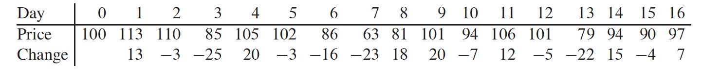

# CLRS-Algorithms
Some algorithm implementations of the book: "Introduction to Algorithms"

#### 1.Insertion Sort 

#### 2. Merge Sort - divide & conquer

#### 3. The Maximum Subarray problem — divide & conquer

* LeetCode — Best Time to Buy and Sell Stock

  

***

#### 4. 0 - 1 Knapsack Problem — Dynamic Programming

